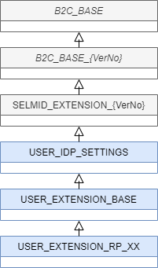

# ID基盤の構成
Azure Active Directory B2C(以下、Azure AD B2C）のカスタムポリシーを利用してSELMIDの振る舞いの設定を行います。

## カスタムポリシーの構造
以下のカスタムポリシーが提供されます。

| ポリシー名 | 契約企業様による編集可否 | 定義内容 |
|:---|:---|:---|
| B2C_BASE | 不可 | バージョン変更による影響をなくす為に必要な定義 |
| [B2C_BASE_{VerNo}](./aadb2c_b2c_base.md) | 不可 | 基本動作に必要な定義 |
| [SELMID_EXTENSION_{VerNo}](./aadb2c_selmid_extension.md) | 不可 | SELMID拡張機能の定義 |
| [USER_IDP_SETTINGS](./aadb2c_config.md#user_idp_settings) | 可 | 契約企業様毎の設定（各種IdPの接続情報） |
| [USER_EXTENSION_BASE](./aadb2c_config.md#user_extension_base) | 可 | 契約企業様毎の各RPの共通定義（スキーマ、UI定義、各種テクニカルプロファイル） |
| [USER_EXTENSION_RP_XX](./aadb2c_config.md#user_extension_rp_xx) | 可 | 契約企業様毎のアプリケーションとの連携設定（呼び出すポリシー単位で作成） |
- 編集不可となっているポリシーの修正～アップロードを行った場合、動作の保証がされません。
- 基本的に上位のポリシーを下位のポリシーがオーバーライドします。



## 各構成内容
※すべての設定可能項目を記載している訳ではありません。公式ドキュメントに記載されている設定項目はご利用いただけますが詳細はお問い合わせください。

## <a id="user_idp_settings"></a>USER_IDP_SETTINGS
各種IdPとの接続情報（`ClaimsProviders`エレメント配下）

### 基本的に以下の情報を設定することで外部IdPと連携します。
| 設定項目 | 説明 | 取得元 | 設定箇所 |
|:---|:---|:---|:---|
| client_id | SELMIDをclient（外部IdPから見たアクセス元アプリケーション）として識別するためのID | 外部IdP | SELMID/USER_EXTENSION_BASE |
| client_secret | SELMIDを正しいclientとして認証するためのシークレット | 外部IdP | SELMID/管理コンソールのポリシーキー |
| redirect_uri | 外部IdPからの戻り先URL（SELMIDのURL） | SELMID<br>`https://yourtenant.b2clogin.com/yourtenant.onmicrosoft.com/oauth2/authresp`を使用 | 外部IdP |

### 対応する外部IdP（随時追加）
| Identity Provider名 | プロトコル | 設定する情報 | 取得できる属性 | IdP側の設定手順 |
|:---|:---|:---|:---|:---|
| Facebook | OAuth2.0 | client_id<br>client_secret<br>scope<br>ClaimsEndpoint | issuerUserId<br>givenName<br>surname<br>displayName<br>email | [facebook for developers](https://developers.facebook.com/docs/apps?locale=ja_JP) |
| X | OAuth1.0a | client_id<br>client_secret | issuerUserId<br>displayName<br>email | [twitter developer](https://developer.twitter.com/en/apps) |
| Google | OAuth2.0 | client_id<br>client_secret | issuerUserId<br>email<br>givenName<br>surname<br>displayName | [Google Developer Console](https://developers.google.com/identity/protocols/OAuth2?hl=ja) |
| LINE | OpenID Connect | client_id<br>client_secret<br>scope | issuerUserId<br>displayName<br>email<br>identityProviderAccessToken | [LINE Developer](https://developers.line.biz/ja/docs/line-login/web/integrate-line-login/) |
| Yahoo! JAPAN | OAuth2.0/<br>OpenID Connect | client_id<br>client_secret<br>scope | issuerUserId<br>displayName<br>email<br>givenName<br>surName | [Yahoo! ID連携](https://developer.yahoo.co.jp/yconnect/v2/) |
| Apple | OpenID Connect | client_id<br>client_secret<br>scope | issuerUserId<br>displayName<br>email<br> | [Sign in with Apple](https://developer.apple.com/sign-in-with-apple/) |
| dアカウント・コネクト | OpenID Connect | client_id<br>client_secret<br>scope | issuerUserId<br>displayName<br>email<br>givenName<br>surName | [dアカウント・コネクト](https://id.smt.docomo.ne.jp/src/index_business.html) |
| auID | OpenID Connect | client_id<br>client_secret<br>scope | issuerUserId<br>displayName<br>email | - |
| xID | OAuth2.0 | client_id<br>client_secret<br>scope | issuerUserId<br>email<br>identityProvider<br>authenticationSource<br>identityProviderAccessToken | [xID for Developers](https://document.x-id.me/) |

## <a id="user_extension_base"></a>USER_EXTENSION_BASE
各RPの共通となるスキーマ、UI定義、各種テクニカルプロファイルの定義

### 設定内容
- [スキーマ（カスタム属性）](./aadb2c_config.md#claimsschema)
  - 標準外の属性を定義します
- [属性変換ルール定義](./aadb2c_config.md#claimstransformations)
  - 属性値を変換する関数を定義します
- [UI定義](./aadb2c_config.md#contentdefinitions)
  - 各種画面テンプレートを定義します
- [各種テクニカルプロファイル定義](./aadb2c_config.md#technicalprofiles)
  - 基盤本体のIDデータベースとのインターフェイス（書き込み・読み込みする属性）等を定義します

### <a id="claimsschema"></a>スキーマ定義(`ClaimsSchema`エレメント配下)
- 参考情報（[公式ドキュメント](https://docs.microsoft.com/ja-jp/azure/active-directory-b2c/claimsschema)）
- 注意点) ClaimType IdのPrefixにより永続させる（Azure AD B2Cのデータベースのスキーマ拡張と属性値の保持）ことが出来るかどうかが決定されます
  - prefixなし : 非永続（カスタムポリシー内のみで利用可能）
  - extension_ : 永続化（Azure AD B2Cのデータベース内に保存可能）
- 定義内容

| 要素種別 | 定義項目 | 説明 |
|:---|:---|:---|
| 属性 | Id | Claim（属性）の識別子 |
| 要素 | Displayname | Claimの表示名 |
|| DataType | 属性の型<br>- string: 文字列<br>- boolean: ブール値<br>- date: 日付型<br>- datetime: 日付時刻型<br>- int: int型<br>- long: long型<br>- stringCollection: 文字列コレクション型<br>- alternativeSecurityIdCollection: 外部IdPの識別子コレクション |
|| Mask | 値のマスクパターン |
|| UserHelpText | ヘルプテキスト |
|| UserInputType | ユーザが値を入力する場合に使うフォームの型<br>- TextBox: テキストボックス<br>- EmailBox: メールアドレス<br>- Password: パスワード<br>- DateTimeDropdown: 日付と時刻の選択<br>- RadioSingleSelect: ラジオボタン<br>- DropdownSingleSelect: ドロップダウンリスト（単一選択）<br>- CheckboxMultiSelect: チェックボックス（複数選択）<br>- Readonly: 表示のみ<br>- Paragraph:メッセージ表示  |
|| Restriction | 入力値を制限する際に使う正規表現 |

- 例 1: 文字列属性（非永続）の定義
```
<ClaimType Id="sampleStringAttribute1">
   <DisplayName>sample string attribute1</DisplayName>
   <DataType>string</DataType>
   <UserInputType>TextBox</UserInputType>
</ClaimType>
```
- 例 2: 文字列属性（永続）の定義
```
<ClaimType Id="extension_samplePersistentAttribute">
   <DisplayName>sample persistent attribute</DisplayName>
   <DataType>string</DataType>
</ClaimType>
```

### <a id="claimstransformations"></a>属性変換ルール定義（`ClaimsTransformations`エレメント配下）
参考情報（[公式ドキュメント](https://docs.microsoft.com/ja-jp/azure/active-directory-b2c/claimstransformations)）　 

SELMIDでは[基本的な属性変換ルール](./aadb2c_b2c_base.md#claimstransformations)と[SELMID拡張の属性変換ルール](./aadb2c_selmid_extension.md#claimstransformations)をビルトインしています。まずはビルトインルールで要件が満たせるかどうかご検討ください。

- 例 : 入力属性値にprefix_をつけて返却する
```
<ClaimsTransformation Id="sampleFormatTransformation" TransformationMethod="FormatStringClaim">
  <InputClaims>
    <InputClaim ClaimTypeReferenceId="sampleStringAttribute1" TransformationClaimType="inputClaim" />
  </InputClaims>
  <InputParameters>
    <InputParameter Id="stringFormat" DataType="string" Value="prefix_{0}" />
  </InputParameters>
  <OutputClaims>
    <OutputClaim ClaimTypeReferenceId="sampleStringAttribute2" TransformationClaimType="outputClaim" />
  </OutputClaims>
</ClaimsTransformation>
```

### <a id="contentdefinitions"></a>UI定義（`ContentDefinitions`エレメント配下）
参考情報（[公式ドキュメント](https://docs.microsoft.com/ja-jp/azure/active-directory-b2c/contentdefinitions)）
本項目ではUIのテンプレートとローカライゼーションを行います。
- UIテンプレートの定義
  - htmlテンプレートを作成し、Azure Storageへ格納します
  - 参考情報（[公式ドキュメント](https://docs.microsoft.com/ja-jp/azure/active-directory-b2c/active-directory-b2c-ui-customization-custom)）
- ローカライゼーションの定義
  - `Localization`エレメント配下に各言語に対応した`ContentDefinition`を用意し、`LocalizedResourcesReferences`に作成したコンテンツ定義の`LocalizedResourcesReferenceId`を指定します
  - 参考情報（[公式ドキュメント](https://docs.microsoft.com/ja-jp/azure/active-directory-b2c/localization)）

### <a id="technicalprofiles"></a>各種テクニカルプロファイル定義（`ClaimsProviders`エレメント配下）
参考情報（[公式ドキュメント](https://docs.microsoft.com/ja-jp/azure/active-directory-b2c/technicalprofiles)）

本項目ではテクニカルプロファイルの定義を行います。
- 例 : 既存の定義に保存対象属性としてgivenNameとsurnameを追加する
```
<TechnicalProfile Id="AAD-UserWriteUsingAlternativeSecurityId">
  <PersistedClaims>
    <!-- 永続させる属性を指定します -->
    <PersistedClaim ClaimTypeReferenceId="givenName" />
    <PersistedClaim ClaimTypeReferenceId="surname" />
  </PersistedClaims>
</TechnicalProfile>
```
## <a id="user_extension_rp_xx"></a>USER_EXTENSION_RP_XX
### 設定内容
- ユーザジャーニー定義
  - アクション単位の動作フローを定義します
- アプリケーションとのインターフェイス定義
  - id_tokenに含める属性を定義します

### ユーザジャーニー定義（`UserJourneys`エレメント配下）
参考情報（[公式ドキュメント](https://docs.microsoft.com/ja-jp/azure/active-directory-b2c/userjourneys)）

| 要素種別 | 定義項目 | 説明 |
|:---|:---|:---|
| 属性 | Id | UserJourneyの識別子 |
| 要素 | OrchestrationSteps | UserJourneyを構成するオーケストレーションステップの定義 |

#### OrchestrationsStepの構成要素
| 要素種別 | 定義項目 | 説明 |
|:---|:---|:---|
| 属性 | Order | 実行順序 |
| 属性 | Type | 実行するステップのタイプ<br>- ClaimsProviderSelection: IdP選択画面の表示<br>- CombinedSignInAndSignUp: サインアップ/サインイン画面の表示<br>- ClaimsExchange: ClaimsProviderと属性の交換<br>- SendClaims: id_tokenの発行 |
| 属性 | ContentDefinitionReferenceId | ClaimsProviderSelection, CombinedSignInAndSignUpの際に表示するコンテンツ定義 |
| 属性 | CpimIssuerTechnicalProfileReferenceId | SendClaimsの際に使うトークン定義 |
| 要素 | Preconditions | ステップを実行する条件 |
| 要素 | ClaimsProviderSelections | TargetClaimsExchangeIdに選択対象となるClaimsProviderのClaimsExchangeIdを指定 |
| 要素 | ClaimsExchanges | 属性交換を行うClaimsProviderのTechnicalProfileを指定 |

例 1: 外部IdPの選択画面を表示し、選択したIdPから属性を取得する
```
<!-- IdP一覧の表示 -->
<OrchestrationStep Order="1" Type="CombinedSignInAndSignUp" ContentDefinitionReferenceId="api.signuporsignin">
  <ClaimsProviderSelections>
    <ClaimsProviderSelection TargetClaimsExchangeId="FacebookExchange" />
    <ClaimsProviderSelection TargetClaimsExchangeId="TwitterExchange" />
    <ClaimsProviderSelection TargetClaimsExchangeId="GoogleExchange" />
    <ClaimsProviderSelection TargetClaimsExchangeId="LINEExchange" />
    <ClaimsProviderSelection TargetClaimsExchangeId="YahooExchange" />
    <ClaimsProviderSelection TargetClaimsExchangeId="AppleExchange" />
    <ClaimsProviderSelection ValidationClaimsExchangeId="LocalAccountSigninEmailExchange" />
  </ClaimsProviderSelections>
  <ClaimsExchanges>
    <ClaimsExchange Id="LocalAccountSigninEmailExchange" TechnicalProfileReferenceId="SelfAsserted-LocalAccountSignin-Email" />
  </ClaimsExchanges>
</OrchestrationStep>
<!-- 選択したIdPから属性を取得する -->
<OrchestrationStep Order="2" Type="ClaimsExchange">
  <ClaimsExchanges>
    <ClaimsExchange Id="FacebookExchange" TechnicalProfileReferenceId="Facebook-OAUTH" />
    <ClaimsExchange Id="TwitterExchange" TechnicalProfileReferenceId="Twitter-OAUTH1" />
    <ClaimsExchange Id="GoogleExchange" TechnicalProfileReferenceId="Google-OAUTH" />
    <ClaimsExchange Id="LINEExchange" TechnicalProfileReferenceId="LINE-OIDC" />
    <ClaimsExchange Id="YahooExchange" TechnicalProfileReferenceId="YahooJAPAN-OAUTH" />
    <ClaimsExchange Id="AppleExchange" TechnicalProfileReferenceId="Apple-OIDC" />
    <ClaimsExchange Id="SignUpWithLogonEmailExchange" TechnicalProfileReferenceId="LocalAccountSignUpWithLogonEmail" />
  </ClaimsExchanges>
</OrchestrationStep>
```

#### Preconditionの構成要素
| 要素種別 | 定義項目 | 説明 |
|:---|:---|:---|
| 属性 | type | 条件のタイプ<br>- ClaimsExist: 属性が存在するか<br>- ClaimEquals: 属性が等しいか |
| 属性 | ExecuteActionsIf | 実行条件<br>- true: typeが真なら実行<br>- false: typeが偽なら実行 |
| 要素 | Value | 判定対象の属性 |
| 要素 | Action | 条件に合致した場合に実行するアクション<br>- SkipThisOrchestrationStep: ステップをスキップする |

参考）Preconditionを複数指定した場合は各条件のorが取られる
例 2: objectIdが存在したらこのステップをスキップする
```
<Preconditions>
  <Precondition Type="ClaimsExist" ExecuteActionsIf="true">
    <Value>objectId</Value>
    <Action>SkipThisOrchestrationStep</Action>
  </Precondition>
</Preconditions>
```

### アプリケーションとのインターフェイス定義（`RelyingParty`エレメント配下）
参考情報（[公式ドキュメント](https://docs.microsoft.com/ja-jp/azure/active-directory-b2c/relyingparty)）

| 要素種別 | 定義項目 | 説明 |
|:---|:---|:---|
| 要素 | DefaultUserJourney | 実行されるUserJourneyの識別子 |
| 要素 | UserJourneyBehaviors | UserJourney実行時の振る舞い（シングルサインオン、セッション）の定義 |
| 要素 | TechnicalProfile | アプリケーションとのインターフェイス定義（プロトコル、id_tokenに含める属性） |

#### TechnicalProfileの構成要素
| 要素種別 | 定義項目 | 説明 |
|:---|:---|:---|
| 属性 | Id | TechnicalProfileの識別子 |
| 構成要素 | DisplayName | TechnicalProfileの表示名 |
| 構成要素 | Protocol | アプリケーションとの連携するプロトコル<br>- OpenIdConnect<br>- SAML2 |
| 構成要素 | OutputClaims | トークンに含める属性 |
| 構成要素 | SubjectNamingInfo | ネーミング属性とする属性名(sub) |

例 1: サインアップ/サインインを行う。OpenID Connect RPとの連携設定
```
<RelyingParty>
  <DefaultUserJourney ReferenceId="SignUpOrSignIn" />
  <UserJourneyBehaviors>
    <SingleSignOn Scope="TrustFramework" KeepAliveInDays="7" />
    <SessionExpiryType>Rolling</SessionExpiryType>
    <SessionExpiryInSeconds>1800</SessionExpiryInSeconds>
  </UserJourneyBehaviors>
  <TechnicalProfile Id="PolicyProfile">
    <DisplayName>PolicyProfile</DisplayName>
    <Protocol Name="OpenIdConnect" />
    <OutputClaims>
      <OutputClaim ClaimTypeReferenceId="displayName" />
      <OutputClaim ClaimTypeReferenceId="givenName" />
      <OutputClaim ClaimTypeReferenceId="surname" />
      <OutputClaim ClaimTypeReferenceId="email" />
      <OutputClaim ClaimTypeReferenceId="objectId" PartnerClaimType="sub" />
      <OutputClaim ClaimTypeReferenceId="identityProvider" />
      <OutputClaim ClaimTypeReferenceId="tenantId" AlwaysUseDefaultValue="true" DefaultValue="{Policy:TenantObjectId}" />
    </OutputClaims>
    <SubjectNamingInfo ClaimType="sub" />
  </TechnicalProfile>
</RelyingParty>
```